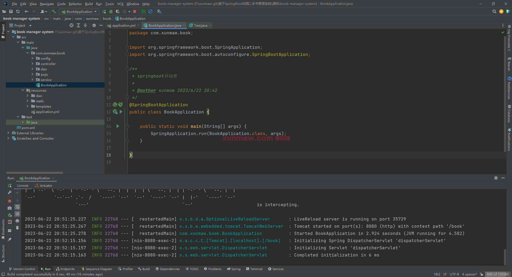
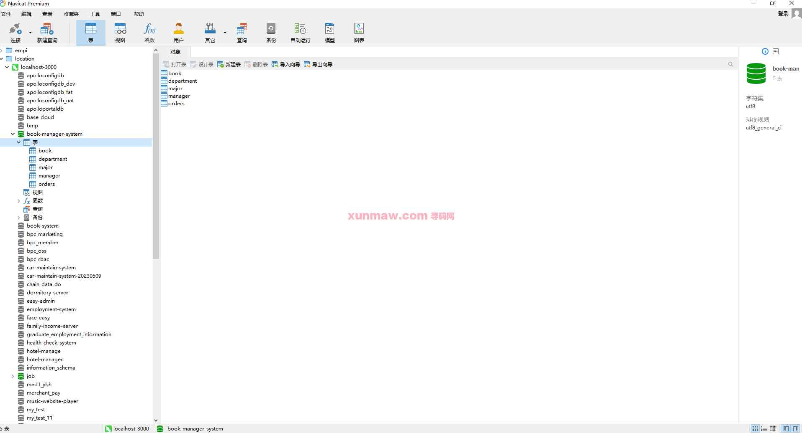
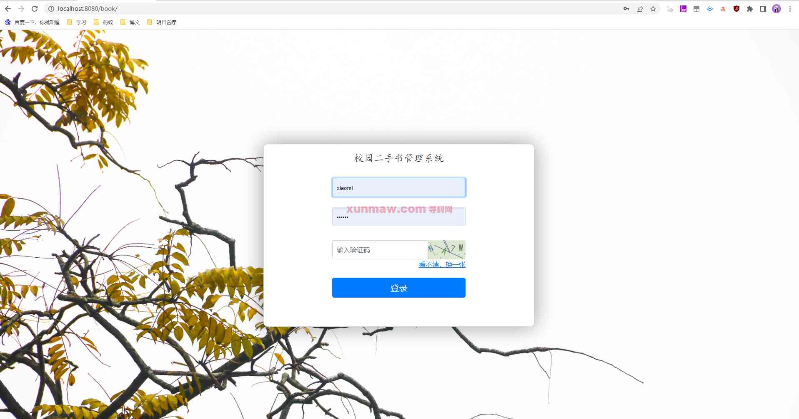
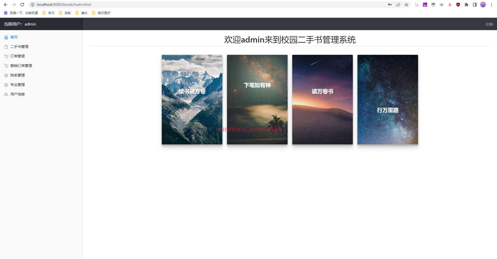
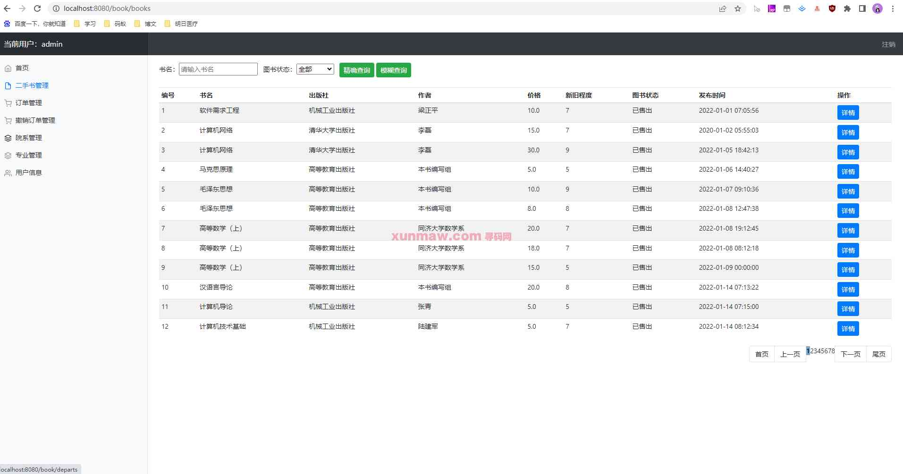
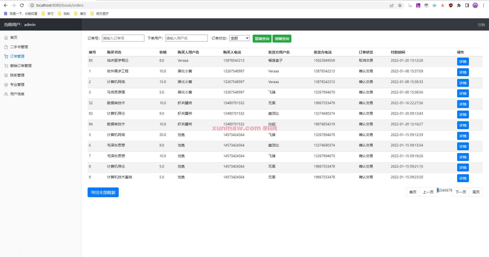
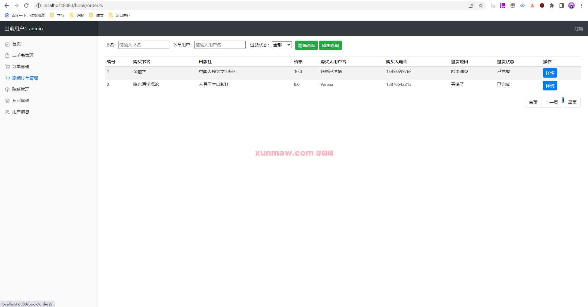
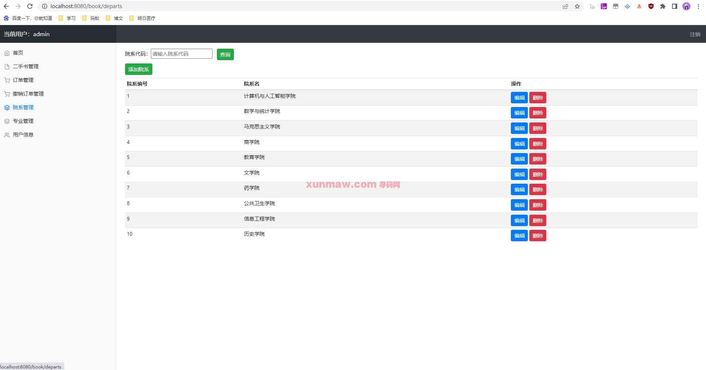
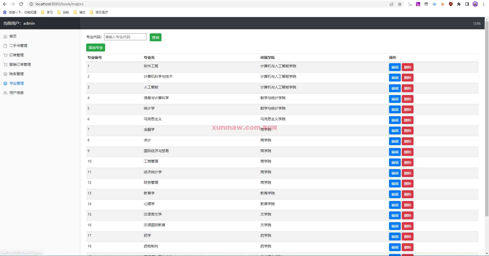
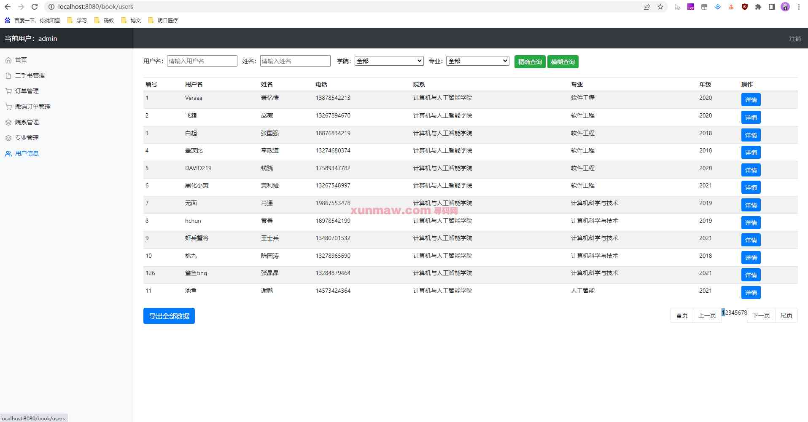

# 基于SpringBoot校园二手书管理系统

##  联系不到我，就看我的主页 
 
#### 介绍
基于springboot实现的校园二手书管理系统，功能主要包含八大模块：登录、首页、二手图书管理、订单管理、撤销订单管理、院系管理、专业管理、用户管理；代码规范，运行简单，适合二次开发做商业用途

#### 软件架构
前端：html | thymeleaf  
后端：springboot | mybatis   
环境：mysql | jdk1.8 | maven     

#### 功能介绍
##### 【代码结构与数据库截图】
  
  

##### 【功能详述】 
1. 登录页  

2. 首页  

3. 二手图书管理  

4. 订单管理  

5. 撤销订单管理  

6. 院系管理  

7. 专业管理  

8. 用户管理  

#### 使用说明
1. 创建数据库，执行数据库脚本  
2. 修改jdbc数据库连接参数  
3. 下载安装maven依赖jar  
4. 启动SpringBoot启动类  

后端管理： 
    请求地址： http://localhost:8080/book  
    用户名：admin    
    密码：123456    